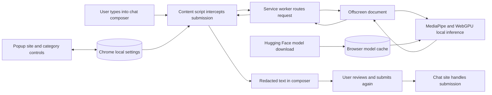

<p align="center"></p>

# PromptMask

[](LICENSE)

PromptMask is Team AER's Chrome extension for masking sensitive details in AI chat prompts. It uses Gemma on your device to replace values with numbered placeholders such as `[NAME 1]` and `[EMAIL 1]`. You review the text in the composer, then submit it again to send.

The extension is Manifest V3, version **0.2.1**. Its product presentation lives in the [AER landing repository](https://github.com/Team-AER/aer-landing/tree/main/promptmask); this repository contains the extension, local model tools, and developer documentation.

## Features

- **Review before sending:** intercepts Enter or Send, writes the redacted result back into the composer, and waits for a second submission. Editing the preview triggers another redaction.
- **Five site controls:** ChatGPT (including `chat.openai.com`), Gemini, Claude, Perplexity, and Grok are configured in the [manifest](extension/manifest.json). Each has a popup toggle.
- **Seven category controls:** choose which kinds of information to mask; all sites and categories start enabled.
- **Local inference:** MediaPipe, bundled WebAssembly assets, and WebGPU run the model in a hidden offscreen document.
- **Model status and progress:** first use downloads approximately 2 GB from Hugging Face; the popup and chat-page banner report progress. Later sessions reuse cached model bytes when available.
- **Output checks:** filters prompt instructions by enabled categories, retries once for disabled placeholder tags, and reports errors if output checks or composer updates fail. Restoration of the original text is best effort.

| Category | Examples of supported placeholders |
|---|---|
| Identity & contact | Name, phone, email, username, address, date of birth |
| Government & legal IDs | SSN, PAN, GST, driver licence |
| Financial & payment | Bank account, credit card, expiry, CVV, PayPal |
| Medical | Insurance ID, medical record number |
| Credentials & secrets | API key, access token |
| Network & device | IP address, device ID |
| Business & case references | Order, invoice, case ID |

These are model instructions, not a guarantee that every sensitive value is found. Review the output, including formatting and any details left unchanged. Site editor changes, unsupported inputs, and disabled site/category controls can affect protection.

## How it works



## Install from source

You need access to this repository, Chrome or a compatible Chromium browser with WebGPU, a supported GPU, and space for the approximately 2 GB model plus runtime memory. Hardware compatibility and performance vary.

1. Clone this repository and open `chrome://extensions`.
2. Enable **Developer mode**, choose **Load unpacked**, and select the **`extension/` directory**, not the repository root. No Python setup or build step is required for the extension.
3. Open the toolbar popup to check site and category settings. Reload any chat tabs that were open before installation.
4. Before first use, review the [Gemma Terms of Use](https://ai.google.dev/gemma/terms) and [Prohibited Use Policy](https://ai.google.dev/gemma/prohibited_use_policy).
5. Use a fictional example on an enabled site. The first intercepted submission starts the model download. Wait for the preview, inspect it, then press Enter or Send again.

If downloading, model initialization, or editor integration fails, read the error message, check connectivity/WebGPU support, and retry with sample data. After editing extension files, reload the extension and the chat tab.

## Privacy and storage

PromptMask's redaction code does not call a cloud inference service. Model downloads use Hugging Face and its delivery hosts; the extension runtime's MediaPipe/WASM assets are bundled locally. The selected model is `gemma-4-E2B-it-web.task`, pinned to revision `a872a24f796a9b2c6d6e5eba63a1b84a5c7e7b73` in [model_cache.mjs](extension/model_cache.mjs).

The browser Cache API stores model bytes. `chrome.storage.local` stores site/category settings and download/loading state, not a prompt history. The extension requests persistent storage, but the browser may deny that request or clear its cache, requiring another download. Downloading via Python into `models/` does not populate the extension's cache.

**Current limits:** original drafts are already present in the chat site's DOM, so its own scripts may read them before you submit. The current offscreen implementation also logs prompts and model outputs to the browser developer console. Use fictional inputs for diagnostics and do not share console exports containing sensitive text. Local inference does not establish that the chat site cannot observe your draft, and disabled controls allow the corresponding data to pass through.

See the separate [privacy-policy repository](https://github.com/Team-AER/PromptMask-legal) and [architecture notes](docs/ARCHITECTURE.md) for context.

## Development and model tools

Read [developer documentation](docs/DOCUMENTATION.md) for the repository layout, tests, and troubleshooting. Node tests use built-in assertions and do not need npm dependencies:

```bash
node extension/offscreen_utils.test.mjs
node extension/model_cache.test.mjs
node category_isolation.test.mjs
node cross_contamination.test.mjs
node redaction_category_toggle.test.mjs
node content_script_editor_resolution.test.mjs
node content_script_validation.test.mjs
node evaluate_redaction_snippets.test.mjs
```

For the separate WebGPU demo, set up Python dependencies in a virtual environment:

```bash
python3 -m venv .venv
source .venv/bin/activate
python -m pip install -r requirements.txt
python download_models.py --list
python download_models.py --model gemma4-e2b-web
python serve_model.py
```

Open `http://localhost:8000/test.html`. This demo fetches MediaPipe JavaScript/WASM from jsDelivr and loads the model from `models/`; its network behavior differs from the extension. Python/MediaPipe package compatibility depends on your interpreter and platform. Some model repositories require Hugging Face authentication and acceptance of their terms.

Custom TFLite bundling is an optional developer workflow, not part of installing PromptMask:

```bash
python bundle_model.py \
  --tflite path/to/model.tflite \
  --tokenizer path/to/tokenizer.model \
  --output my_custom_model.task \
  --model-type gemma3
```

Creating a bundle does not change the extension's pinned model. The separate LiteRT-LM CLI is not bundled here, and no CPU inference support for the extension's WebGPU `.task` file is claimed.

## Documentation and credits

- [Developer guide](docs/DOCUMENTATION.md)
- [Architecture and privacy boundaries](docs/ARCHITECTURE.md)
- [Data flow](docs/DATA_FLOW.md)
- [Component reference](docs/COMPONENTS.md)
- [Settings, messages, and placeholder schema](docs/DATA_MODEL.md)
- [Technology overview](docs/TECH_STACK.md)
- [Model publication checklist](docs/huggingface_publish_checklist.md)

PromptMask builds on Google's Gemma and MediaPipe tooling and the LiteRT community's converted model assets. Their respective terms and notices continue to apply. Gemma model binaries are downloaded separately and are not committed in this repository. Preserve the [NOTICE](NOTICE) and applicable model terms when packaging or redistributing model files. Project and extension code are released under the [MIT License](LICENSE), with the extension copy in [extension/LICENSE](extension/LICENSE). The vendored MediaPipe runtime retains its [Apache License 2.0](extension/lib/LICENSE). Gemma model files are downloaded separately and are not covered by the MIT License; their model terms and use restrictions continue to apply.

## Gemma compliance notes


This repository does not commit Gemma model binaries into version control. Users download model files separately into `models/`, and those model files remain subject to Google's Gemma Terms of Use and Gemma Prohibited Use Policy.

If you later change this project or the Chrome extension to download Gemma model files for users from your own source on first run, treat that as redistribution of Gemma. In that case you should:

- keep a `NOTICE` file with the exact Gemma notice text in any package or distribution that includes the model files
- provide recipients a copy or link to the current Gemma Terms of Use
- provide clear notice that Gemma use is subject to the Section 3.2 use restrictions and the Prohibited Use Policy
- add your own app or extension terms that make those use restrictions enforceable for your users
- mark any modified Gemma files prominently if you ever modify, convert, or rebundle them

For a future first-run model download flow, document the model source in user-facing docs or the extension onboarding screen. The terms do not appear to require naming the origin host, but disclosing the source is the practical way to tell users what they are downloading, who is redistributing it, and where the governing terms apply.

This project is a local redaction helper, not a substitute for legal, medical, financial, or other licensed professional services. Review outputs before relying on them in sensitive workflows.
