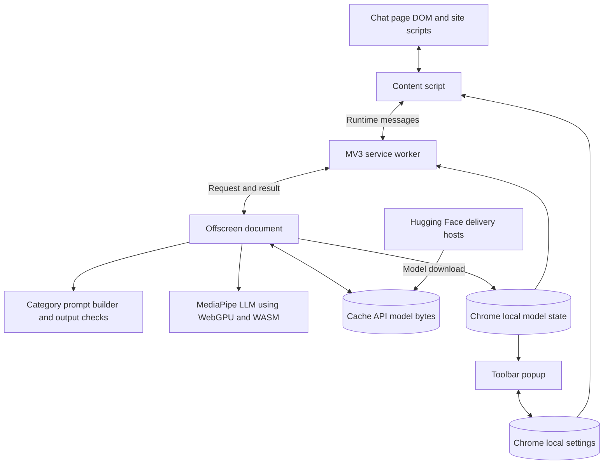
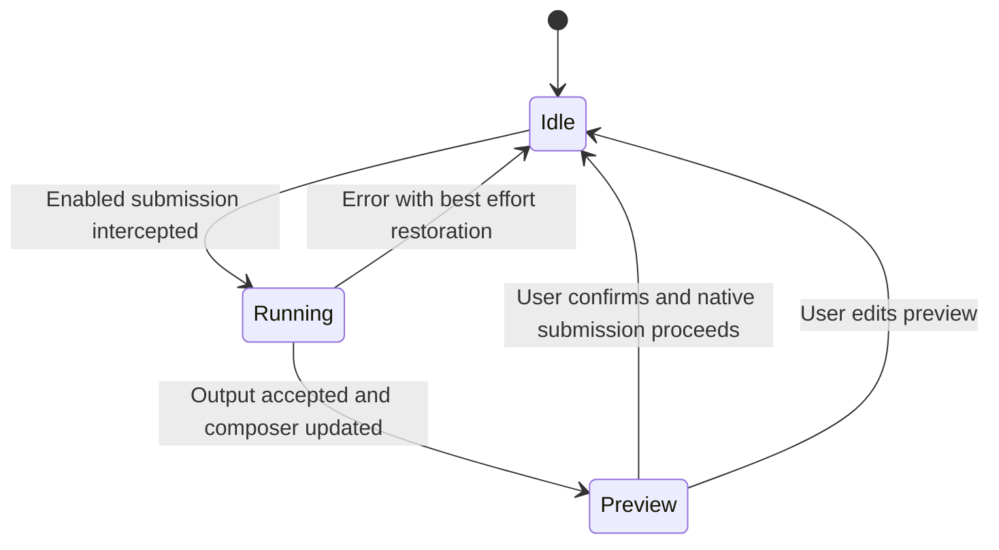

# PromptMask architecture

PromptMask separates chat-page integration, request routing, local inference, and settings into four Chrome extension contexts. See the [data flow](DATA_FLOW.md) and [component reference](COMPONENTS.md).

## Execution contexts

| Context | Responsibility and lifetime |
|---|---|
| Content script | Reads/writes the chat DOM and captures submission events; reloads with the tab |
| Service worker | Creates the offscreen document and routes requests/results; Chrome can suspend it |
| Offscreen document | Hosts the model instance, inference queue, and cache access; model is reused while alive |
| Popup | Reads/writes controls and displays model state while open |

The offscreen document supplies the document context used by this implementation for MediaPipe/WebGPU. The service worker has no DOM; its pending callbacks and progress subscribers are transient. Durable settings and state live in browser storage. Cache API use is a choice of the current model loader, not a claim that service workers lack that API.

## Submission states

The first submission is consumed. A successful redaction enters preview; a second submission proceeds through the site's own handler. Editing resets the preview so the next submission runs redaction again. The content script also uses a short native-submission bypass to avoid consuming related events twice.

## Privacy boundaries

Inference takes place in extension contexts without a cloud inference endpoint. Hugging Face receives model download requests; extension code does not attach the prompt to those requests. The chat site handles the eventual confirmed submission.

The original prompt is typed into the host page's DOM before interception. Isolated extension JavaScript does not hide that DOM from the site's scripts. Therefore, local inference does not guarantee that the site cannot read or transmit draft text. Disabled controls and unsupported submission paths also limit coverage.

`chrome.storage.local` holds settings and model state, and the Cache API holds model bytes. There is no application prompt-history store in those APIs. However, `offscreen.js` currently logs full prompts and model output in the developer console, and other error logs can contain text. Treat diagnostic exports as potentially sensitive.

## Validation and failure handling

The model prompt includes enabled placeholder categories and examples. Output is normalized and checked for disallowed placeholder keys; one correction round is attempted before returning an error. The content script checks for empty or unusually short output and whether the editor reflects the replacement. These checks do not guarantee complete or correct masking.

On failure the intercepted submission stays blocked and the extension attempts to preserve or restore the original composer contents, then displays an error. Restoration is best effort because editor integrations can fail. Cached model bytes avoid repeat network downloads when retained, but GPU initialization still takes time after the offscreen document restarts.
