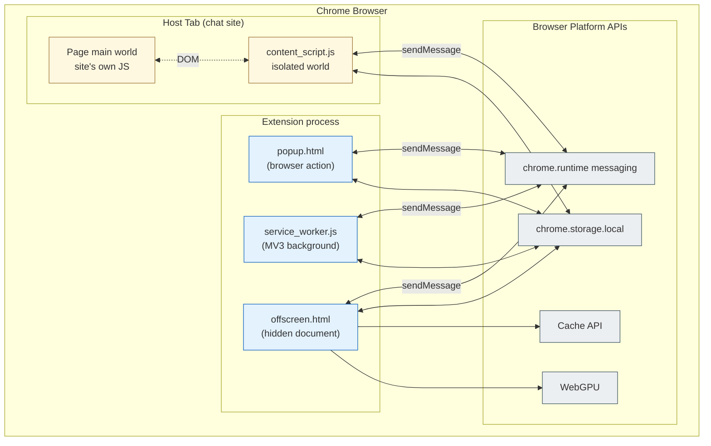
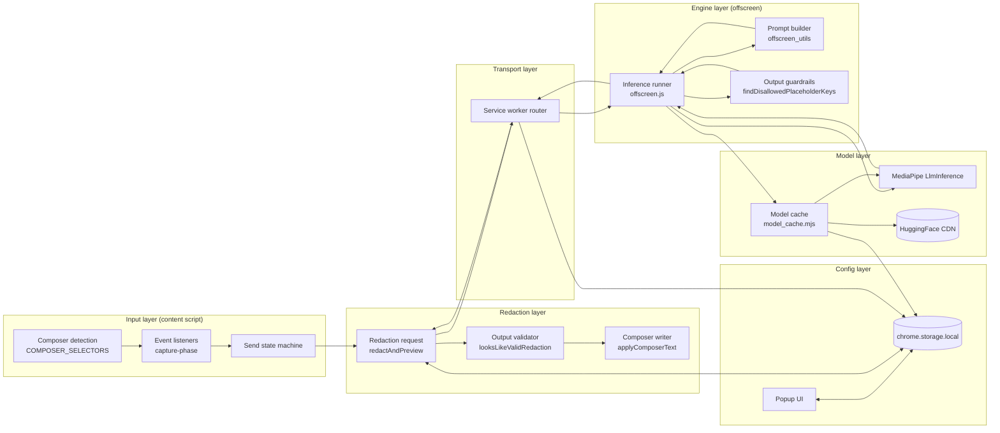
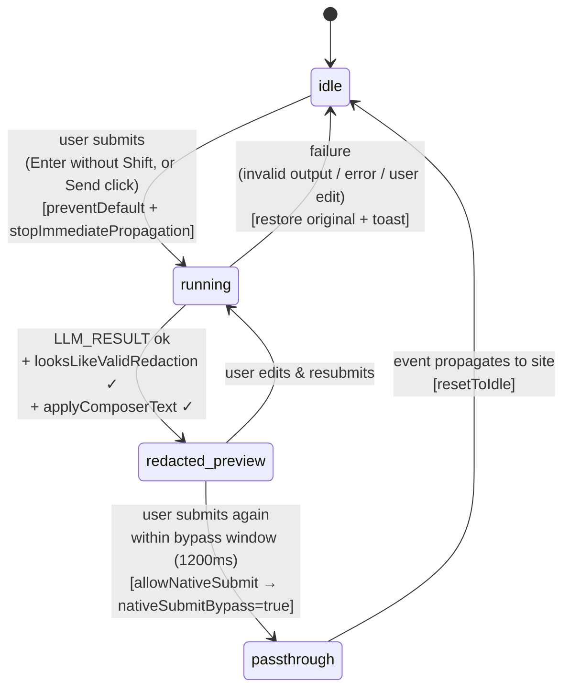
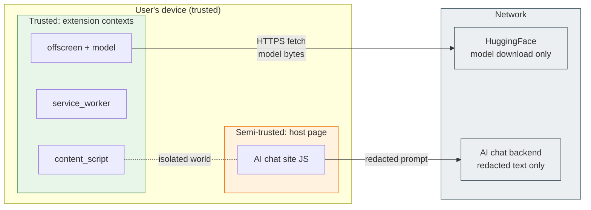
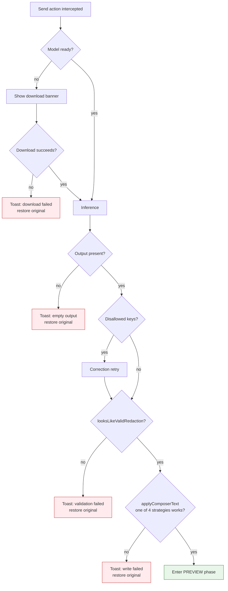

# Architecture

This document goes deeper than [DOCUMENTATION.md §4](DOCUMENTATION.md#4-system-architecture). It covers the **execution-context model**, **trust boundaries**, and the **key state machines** inside the extension.

---

## 1. Execution contexts

Chrome MV3 isolates code into several runtime contexts. PromptMask uses four, each with different capabilities:

### Capability matrix

| Context | DOM access | WebGPU | Cache API | Persistent state | Module imports |
|---|---|---|---|---|---|
| Page main world | ✅ full | ✅ | ✅ | ✅ | ✅ |
| Content script (isolated world) | ✅ DOM only (no page JS globals) | ❌ | ❌ | ❌ (use messaging → SW) | ❌ (classic script) |
| Service worker | ❌ | ❌ | ❌ | ❌ (ephemeral; use `storage`) | ✅ (`"type": "module"`) |
| Offscreen document | ✅ (its own hidden DOM) | ✅ | ✅ | ✅ while alive | ✅ |
| Popup | ✅ (own DOM) | ✅ | ✅ | ✅ while open | ✅ |

This capability asymmetry is why the architecture looks the way it does:
- **Redaction must happen in the offscreen doc** — only it has WebGPU + Cache API.
- **The service worker can't hold the model** — it gets killed; the offscreen doc doesn't.
- **The content script can't call MediaPipe** — it has no module support and no WebGPU in isolated-world pages.
- The service worker is therefore reduced to a **pure router**.

---

## 2. Logical component map

---

## 3. Send-interception state machine (content script)

The content script runs a small state machine per composer element. This is where most of the subtlety lives — every chat site has different quirks around how Enter and the Send button dispatch events.

**Code mapping:** `idle` = `PHASE_IDLE` constant; `running` = `state.running === true` (no dedicated phase value); `redacted_preview` = `PHASE_PREVIEW` constant; `passthrough` = `state.nativeSubmitBypass === true`.

**Why two phases?** The extension can't submit for the user — that would require synthesizing a trusted event. Instead it shows the redacted version and asks the user to confirm with a second Enter. The passthrough window (`nativeSubmitBypass`) exists for exactly one event dispatch (1200 ms timeout).

---

## 4. Trust boundaries

Key invariant: **original (un-redacted) text must never cross the `content_script → page main world` boundary except through `applyComposerText`, and only after passing `looksLikeValidRedaction`.** If the model output is rejected, the composer is restored to the original — the original never touches `window.fetch` etc. because it was already sitting in the composer.

---

## 5. Why each design choice

| Decision | Rationale |
|---|---|
| Use the **Cache API** for model storage, not IndexedDB | Cache stores `Response` objects natively; MediaPipe accepts a `ReadableStream`, avoiding a full-in-memory copy of 2 GB |
| **`tee()`** the download stream | Write to cache + feed inference simultaneously; the second run is instant because the cache is already warm |
| **Service worker stays stateless** (just a Map of pending callbacks) | MV3 can terminate the SW at any time; all durable state lives in `chrome.storage.local` and the offscreen doc |
| **Two-phase submit** (`idle` → `running` → `redacted_preview` → passthrough) | Extensions can't synthesize trusted events that bypass site security; the user’s second Enter is the only reliable trigger |
| **Disallowed-key correction retry** | Open-weight models occasionally emit tags they weren't told about; one correction round has measurable improvement (see `category_toggle_eval_results.json`) |
| **Deterministic decoding** (`temperature=0, topK=1, seed=1`) | Users expect the same input to produce the same redaction; also makes evals reproducible |

---

## 6. Failure modes & fallbacks

Every error path **restores the original composer text** so the user never loses work.
