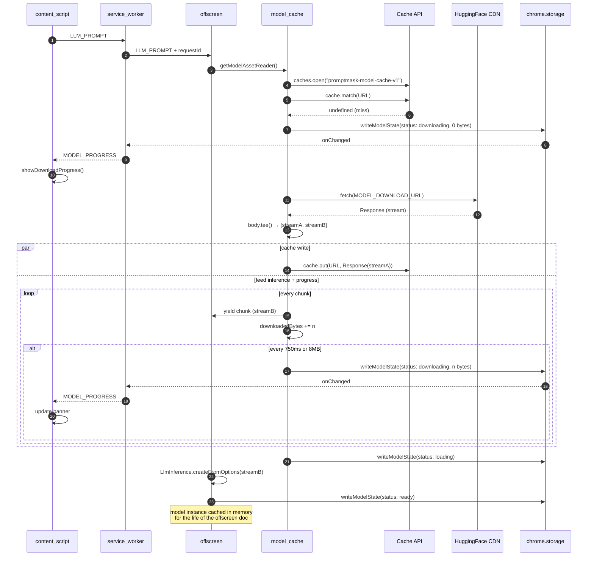
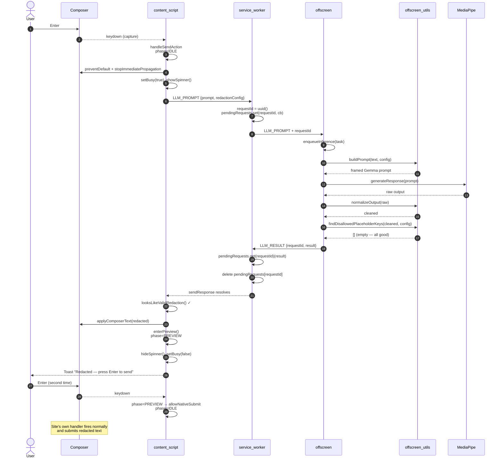
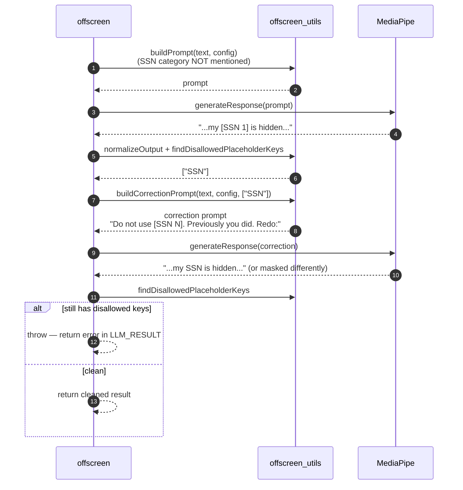
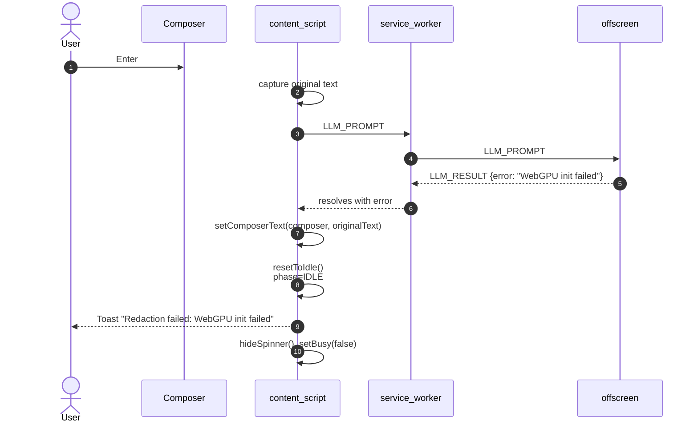
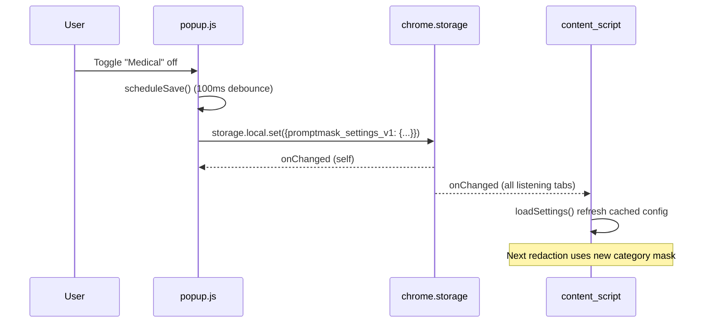
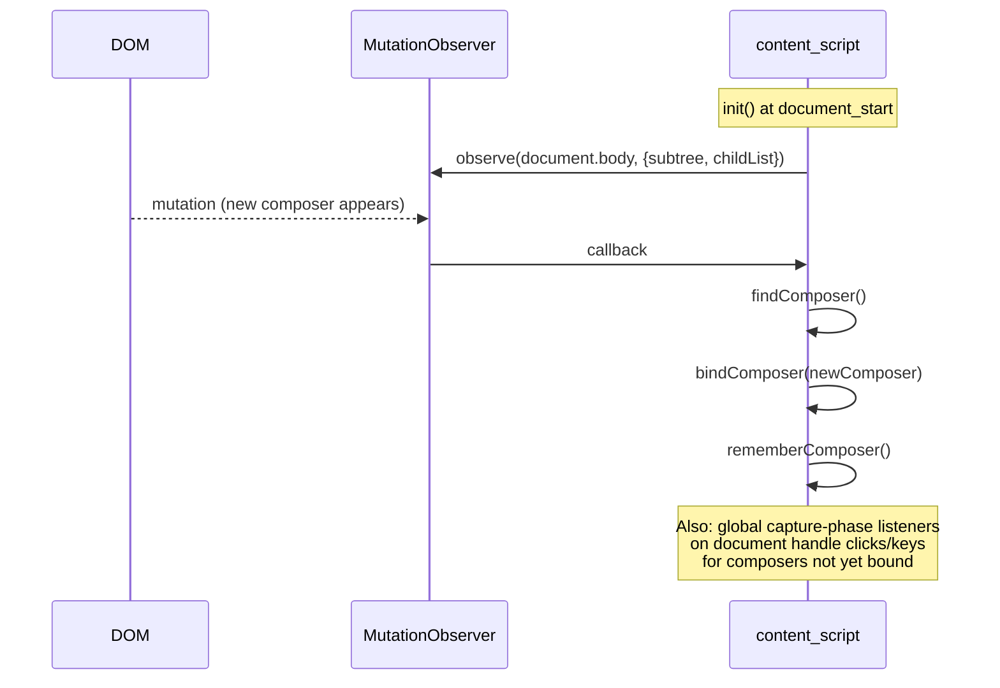

# Data Flow

Detailed sequence diagrams for the main flows. For the top-level happy-path diagram, see [DOCUMENTATION.md §5](DOCUMENTATION.md#5-end-to-end-data-flow).

---

## 1. First-run: model download

Triggered the first time the user sends a message with redaction enabled.

---

## 2. Happy-path redaction (model already loaded)

---

## 3. Correction retry (model emits a disabled placeholder)

Happens when the user has e.g. disabled `governmentLegal` but the model still outputs `[SSN 1]`.

Only **one** correction round is attempted; a second failure surfaces as an error to the content script, which restores the original text.

---

## 4. Failure / restoration

Same pattern applies if `looksLikeValidRedaction` rejects the output or if all four `applyComposerText` strategies fail.

---

## 5. Settings update (popup → content script)

No messaging between popup and content script — `chrome.storage.onChanged` is the bus.

---

## 6. Composer detection on navigation

AI chat sites are SPAs; the composer element changes on route changes.

The combination of a MutationObserver and document-level capture-phase listeners is why the extension works reliably across route changes on all five sites.
