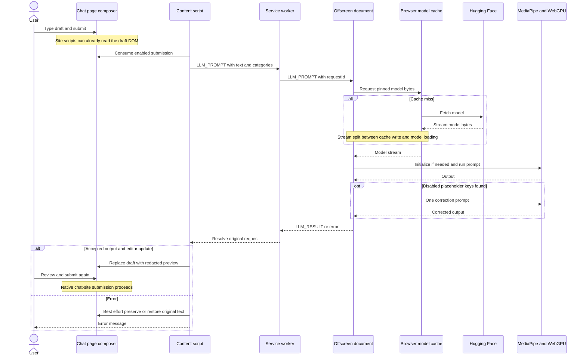

# PromptMask data flow

See the [architecture](ARCHITECTURE.md) for context and [data model](DATA_MODEL.md) for message schemas.

The actual inference request is queued to prevent overlapping model calls. The in-memory instance is reused while the offscreen document lives; the cached bytes are reused across sessions when retained. Current console logs include prompts and output.

Model state changes travel through `chrome.storage.local` to the popup and service worker; the worker forwards `MODEL_PROGRESS` to subscribed chat tabs. Cache download/loading states are separate from inference completion.

Popup toggles save `promptmask_settings_v1` with a short debounce. Content scripts refresh cached settings through `chrome.storage.onChanged`; the next redaction uses the new category configuration. All controls default to enabled.

Composer discovery combines selectors, a DOM mutation observer, and document-level capture handlers. This supports changing SPA editors but does not establish compatibility with every live site revision.
