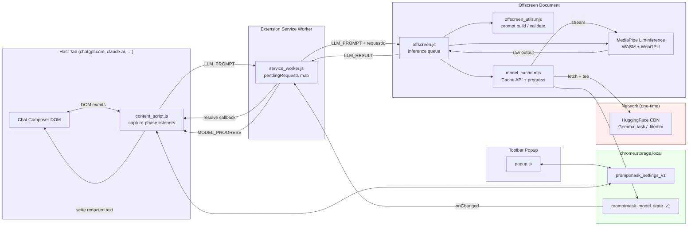
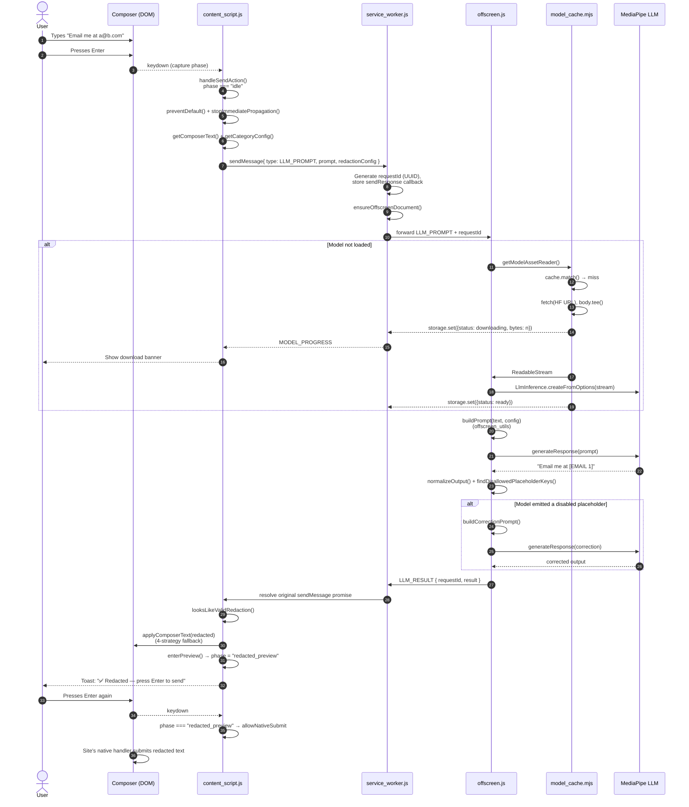
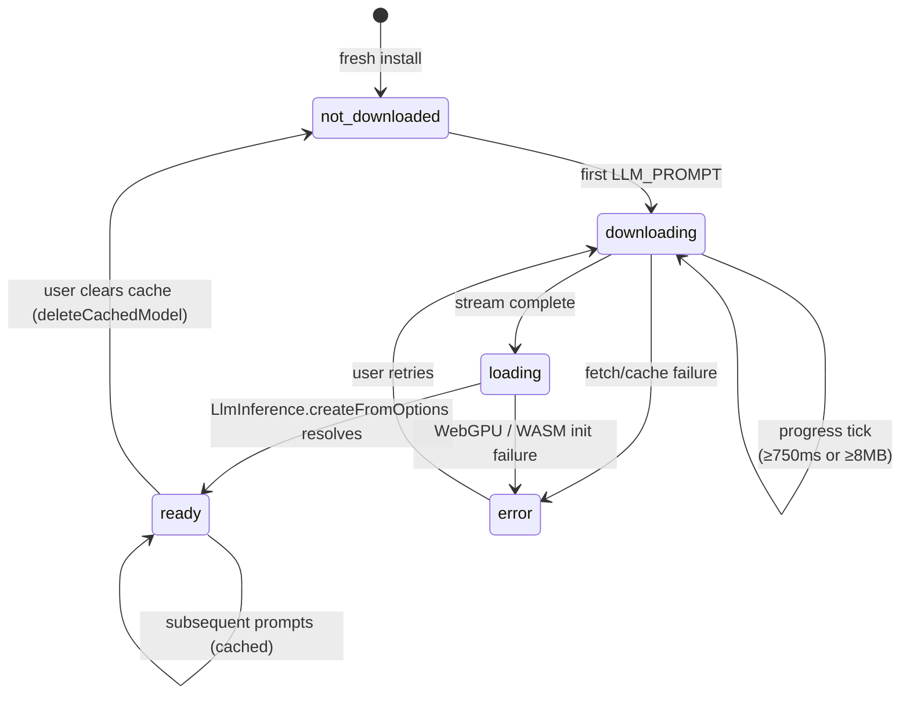
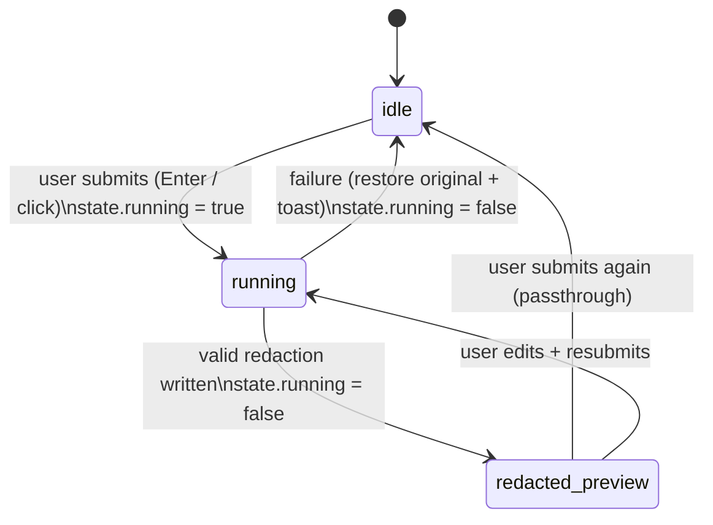

# PromptMask — Project Documentation

> A privacy-first Chrome extension that redacts personally identifiable information (PII) from prompts **on-device** before they reach ChatGPT, Gemini, Claude, Perplexity, or Grok. All inference runs locally via WebGPU + MediaPipe; no original prompt ever leaves the device.

---

## Table of Contents

1. [Overview](#1-overview)
2. [Quick Start](#2-quick-start)
3. [Repository Layout](#3-repository-layout)
4. [System Architecture](#4-system-architecture)
5. [End-to-End Data Flow](#5-end-to-end-data-flow)
6. [Component Reference](#6-component-reference)
7. [Data Structures & Messages](#7-data-structures--messages)
8. [Model Lifecycle](#8-model-lifecycle)
9. [Redaction Logic](#9-redaction-logic)
10. [Testing & Evaluation](#10-testing--evaluation)
11. [Permissions & Supported Sites](#11-permissions--supported-sites)
12. [Dependencies](#12-dependencies)
13. [Glossary](#13-glossary)

---

## 1. Overview

PromptMask is a **Manifest V3 Chrome extension** that sits between the user and web-based AI chat services. When the user submits a message, the extension:

1. **Intercepts** the send action before the page sees it.
2. **Sends the prompt** to a hidden offscreen document that hosts a local LLM (Google Gemma, LiteRT-LM format).
3. **Replaces PII** with numbered placeholders like `[NAME 1]`, `[EMAIL 1]`, `[SSN 2]`.
4. **Shows the redacted text** in the composer for user review.
5. **Releases the send action** once the user confirms.

### Design goals

| Goal | How it's achieved |
|---|---|
| **Zero data egress** | Model + tokenizer run in-browser (WebGPU + WASM); only model download itself hits the network (HuggingFace CDN, one-time) |
| **Deterministic output** | `temperature=0`, `topK=1`, `randomSeed=1` |
| **Per-site / per-category control** | 5 site toggles, 7 PII-category toggles, stored in `chrome.storage.local` |
| **Guardrails on model output** | Output is validated; if it emits disabled placeholder tags, a correction prompt is run |
| **Safe fallback** | If redaction fails or looks wrong, the original text is restored and an error toast is shown |

> **Analogy for backend engineers:** think of it as an outbound egress proxy that rewrites request bodies before they leave the user's "network" — except the proxy is the browser, the rewriter is an on-device LLM, and the "network" boundary is the chat site's send button.

---

## 2. Quick Start

### Prerequisites
- Chrome / Chromium with WebGPU enabled
- Python 3.10+ (only for downloading the model locally during dev)
- Approx. 2 GB disk for the model

### Install (unpacked extension)
```bash
# 1. (Optional) download model locally for dev/testing
python -m venv .venv && source .venv/bin/activate
pip install -r requirements.txt
python download_models.py --model gemma4-e2b-web

# 2. Load the extension
#    Chrome → chrome://extensions → Developer mode → "Load unpacked" → select ./extension
```

On first prompt submission, the extension streams the model (~2 GB) from HuggingFace into the browser's Cache API. Subsequent loads are instant.

### Run the standalone web demo
```bash
python serve_model.py
# open http://localhost:8000/test.html
```

### Run unit tests
```bash
node extension/offscreen_utils.test.mjs
node extension/model_cache.test.mjs
node category_isolation.test.mjs
node cross_contamination.test.mjs
# … and other *.test.mjs at the repo root
```

---

## 3. Repository Layout

```
PromptMask/
├── extension/                     # Chrome MV3 extension (the shipped product)
│   ├── manifest.json              # Permissions, content scripts, CSP
│   ├── service_worker.js          # Background router (MV3 service worker)
│   ├── content_script.js          # Injected into AI chat pages (1600+ lines)
│   ├── offscreen.html/.js         # Hidden page that hosts MediaPipe LLM
│   ├── offscreen_utils.mjs        # Prompt templates, output normalization, validation
│   ├── model_cache.mjs            # Cache-API-backed model download/streaming
│   ├── popup.html/.js/.css        # Toolbar popup (site + category toggles)
│   └── lib/
│       ├── genai_bundle.mjs       # Re-exports MediaPipe LlmInference / FilesetResolver
│       └── wasm/                  # MediaPipe WASM + JS glue
│
├── docs/                          # Design notes, tech stack, this documentation
│   ├── DOCUMENTATION.md           # ← you are here
│   ├── ARCHITECTURE.md            # Architecture diagrams
│   ├── DATA_FLOW.md               # Sequence diagrams
│   ├── COMPONENTS.md              # Per-file API reference
│   ├── DATA_MODEL.md              # Storage keys, messages, entity types
│   ├── TECH_STACK.md              # Pre-existing tech overview
│   └── sequence-diagram-walkthrough.md
│
├── download_models.py             # HF Hub downloader CLI
├── bundle_model.py                # Bundles custom TFLite + tokenizer → .task
├── serve_model.py                 # Dev HTTP server (CORS-enabled)
├── test.html                      # Standalone WebGPU demo page
├── *.test.mjs / evaluate_*.mjs    # Node test harnesses + eval scripts
├── requirements.txt               # Python deps (mediapipe, huggingface_hub, tqdm)
└── models/                        # (gitignored) downloaded model artifacts
```

---

## 4. System Architecture

PromptMask has **four isolated JS contexts** that communicate via `chrome.runtime` messaging and `chrome.storage` change events:



### Why an offscreen document?

MV3 service workers can't use WebGPU, `caches`, or long-lived state. The **offscreen document** is a hidden HTML page the extension spins up on demand (reason: `"IFRAME_SCRIPTING"`, declared via `chrome.offscreen.createDocument`). It's the only MV3 context where we can:
- Hold a persistent `LlmInference` instance.
- Use WebGPU.
- Stream a 2 GB download without losing the reference when the service worker sleeps.

### Why capture-phase listeners in the content script?

Chat sites (especially ProseMirror-based Claude, Lexical-based Gemini) attach their own keyboard handlers that submit the form synchronously. To intercept **before** the site reads the keystroke, the content script binds listeners on `document` with `{ capture: true }` and calls `stopImmediatePropagation()` + `preventDefault()`.

> See [ARCHITECTURE.md](ARCHITECTURE.md) for more detailed diagrams (component boundaries, state machine of the send interception).

---

## 5. End-to-End Data Flow

A full "user presses Enter → redacted text appears in composer" round trip:



> See [DATA_FLOW.md](DATA_FLOW.md) for additional flows: model download progress, correction retry, failure/restoration.

---

## 6. Component Reference

### 6.1 `extension/content_script.js` (~1564 lines)

Injected into every supported AI chat page at `document_start`, runs in all frames.

| Concern | Key functions / line refs |
|---|---|
| **Composer detection** | `COMPOSER_SELECTORS` (~L1–L47, 46 selectors for textarea / contenteditable / ProseMirror / Lexical / rich-textarea), `findComposer()` (L658–L733), `bindComposer()` (L1352–L1422) |
| **Send interception** | `handleSendAction()` (L1317–L1351) — two-phase (idle → preview); `isEnterSubmit()` (L1093), `shouldBypassSendInterception()` (L1122) |
| **Redaction orchestration** | `redactAndPreview()` (L1214–L1315) |
| **Composer write-back** | `applyComposerText()` (L501–L519) — 4 strategies (`execCommand`, synthetic `beforeinput`, synthetic `paste` ClipboardEvent, direct DOM) |
| **Validation** | `looksLikeValidRedaction()` (L1176) |
| **Settings** | `SETTINGS_STORAGE_KEY = "promptmask_settings_v1"` (L107), `loadSettings()` (L586), `getCategoryConfig()` (L630), `getEnabledPlaceholders()` (L634) |
| **UI** | `showSpinner/hideSpinner` (L337–L369), `showToast()` (L942), `showDownloadProgress()` (L974), `setBusy()` (L1057) |
| **Global listeners** | `bindGlobalFallbackHandlers()` (L1512–L1616) — capture-phase document listeners for focusin / input / keydown / pointerdown / click |
| **Entrypoint** | `init()` (L1618) → `loadSettings` + `observeComposer` + `bindGlobalFallbackHandlers` |

### 6.2 `extension/service_worker.js` (~91 lines)

Thin message router — intentionally stateless between requests except for in-flight callbacks.

| Symbol | Purpose |
|---|---|
| `pendingRequests: Map<UUID, sendResponse>` | Correlates offscreen responses with content-script requests |
| `progressSubscribers: Set<tabId>` | Which tabs want model-download progress relayed |
| `ensureOffscreenDocument()` (L7–L18) | Idempotent creation of the offscreen page |
| `chrome.storage.onChanged` (L21–L39) | Watches `promptmask_model_state_v1`; pushes `MODEL_PROGRESS` to subscriber tabs |
| `chrome.runtime.onMessage` (L41–L90) | Routes `LLM_PROMPT` → offscreen; `LLM_RESULT` → content script |

### 6.3 `extension/offscreen.js` (~135 lines)

Hosts MediaPipe and serializes inference calls.

| Symbol | Purpose |
|---|---|
| `initModel()` (L17–L53) | Lazy; resolves WASM via `FilesetResolver.forGenAiTasks`, calls `getModelAssetReader()`, creates `LlmInference` with `maxTokens: 16384, temperature: 0, topK: 1, randomSeed: 1` |
| `runInference()` (L55–L74) | `generateResponse()` wrapper (falls back to `generate()`) |
| `enqueueInference()` (L76–L80) | Promise-chain queue to serialize concurrent prompts |
| `onMessage` (L82–L134) | Handles `LLM_PROMPT`, builds prompt, runs inference, runs **correction retry** if disallowed keys are found, posts `LLM_RESULT` |

### 6.4 `extension/offscreen_utils.mjs` (~338 lines)

Pure-function helpers — fully unit-tested.

| Symbol | Purpose |
|---|---|
| `PROMPT_PREAMBLE` (L1) | System instruction |
| `CATEGORY_PLACEHOLDER_LINES` (L9–L48) | Per-category placeholder schema (`[NAME N]`, `[SSN N]`, …) |
| `GENERIC_NUMBERING_RULES` (L50–L60) | Shared numbering and de-duplication rules applied to all prompts |
| `CATEGORY_RULES` (L61–L89) | Extra heuristics (e.g., DOBs, partial addresses) |
| `PROMPT_EXAMPLES` (L91–L169) | 14 in-context examples |
| `CATEGORY_TO_PLACEHOLDER_KEYS` (L173) | Maps 7 categories → allowed placeholder keys |
| `buildRedactionPrompt(enabledKeys)` (L183) | Filters preamble/rules/examples to enabled categories only |
| `buildPrompt(text, cfg)` (L255) | Wraps with Gemma `<start_of_turn>user … <start_of_turn>model` framing |
| `buildCorrectionPrompt(text, cfg, bad)` (L274) | Self-correction prompt when model emits disabled tags |
| `extractPlaceholderKeys()` (L290) | Regex `/\[[A-Z_]+\s+\d+\]/g` |
| `findDisallowedPlaceholderKeys()` (L306) | Set-difference vs. enabled keys |
| `normalizeOutput()` (L315) | Strips Gemma turn tags and continuation markers |

### 6.5 `extension/model_cache.mjs` (~323 lines)

Cache API wrapper with progress reporting via Storage.

| Symbol | Purpose |
|---|---|
| `MODEL_DOWNLOAD_URL` (L5) | HuggingFace CDN URL for Gemma `.task` |
| `MODEL_CACHE_NAME = "promptmask-model-cache-v1"` | Cache API namespace |
| `MODEL_STATE_KEY = "promptmask_model_state_v1"` | Storage key for state object |
| `readModelState / writeModelState` (L119, L128) | Normalized state I/O |
| `requestPersistentStorage()` (L165) | `navigator.storage.persist()` so the browser doesn't evict the 2 GB blob |
| `createProgressReader()` (L187) | Wraps response stream; emits progress every 750 ms or 8 MB |
| `getModelAssetReader()` (L247) | Top-level entry: cache hit → return cached; miss → `fetch().body.tee()` to cache + progress stream |

### 6.6 `extension/popup.js` (~207 lines)

Straightforward form-bound settings editor backed by `chrome.storage.local`.

| Symbol | Purpose |
|---|---|
| `SITE_TOGGLE_IDS` / `CATEGORY_TOGGLE_IDS` | Map keys to DOM IDs |
| `DEFAULT_SETTINGS` (L23) | All sites + all categories enabled |
| `readSettingsFromUI / applySettingsToUI` | Two-way binding |
| `scheduleSave()` (L162) | 100 ms debounce |
| `renderModelState()` (L73) | Renders status pill from `MODEL_STATE_KEY` |

### 6.7 Python helpers

| Script | Purpose |
|---|---|
| `download_models.py` | `hf_hub_download` wrapper; `--list`, `--model`, `--all`, `--output-dir` flags. Registry in `MODELS` dict (2 variants) |
| `bundle_model.py` | Rebundles custom TFLite + SentencePiece tokenizer into MediaPipe `.task` format |
| `serve_model.py` | `ThreadingHTTPServer` with CORS headers; serves `test.html` + `models/` |

> See [COMPONENTS.md](COMPONENTS.md) for the full API surface of each module.

---

## 7. Data Structures & Messages

### 7.1 Settings (user-controlled)

```js
// chrome.storage.local["promptmask_settings_v1"]
{
  sites: {
    chatgpt: true, gemini: true, claude: true,
    perplexity: true, grok: true
  },
  categories: {
    identityContact: true,      // NAME, PHONE, EMAIL, USERNAME, ADDRESS, DATE_OF_BIRTH
    governmentLegal: true,      // SSN, PAN, GST, DRIVER_LICENSE
    financialPayment: true,     // BANK_ACCOUNT, CREDIT_CARD, CARD_EXPIRY, CARD_CVV, PAYPAL
    medical: true,              // INSURANCE_ID, MRN
    credentialsSecrets: true,   // API_KEY, ACCESS_TOKEN
    networkDevice: true,        // IP_ADDRESS, DEVICE_ID
    businessCase: true          // ORDER_ID, INVOICE_ID, CASE_ID
  }
}
```

### 7.2 Model state (managed by `model_cache.mjs`)

```js
// chrome.storage.local["promptmask_model_state_v1"]
{
  status: "not_downloaded" | "downloading" | "loading" | "ready" | "error",
  revision: string,
  fileName: string,
  sourcePageUrl: string,
  downloadUrl: string,
  expectedBytes: number,
  totalBytes: number,
  downloadedBytes: number,
  lastUpdatedAt: ISO8601 | null,
  error: string | null
}
```

### 7.3 Placeholder format

Format: `[KEY N]` where `N` starts at 1 per category and increments per **distinct** value (same value → same number within a single prompt).

```
"Hi, I'm Alice (alice@x.com). Bob (bob@x.com) is my colleague. Alice owns acct."
  ↓
"Hi, I'm [NAME 1] ([EMAIL 1]). [NAME 2] ([EMAIL 2]) is my colleague. [NAME 1] owns acct."
```

### 7.4 Redaction config (wire format, content script → offscreen)

```js
{
  categories: { identityContact: true, ... },      // verbatim from settings
  enabledPlaceholders: ["NAME", "EMAIL", "PHONE"]  // flattened allow-list
}
```

### 7.5 Message envelopes

```mermaid
flowchart LR
    CS[content_script] -->|LLM_PROMPT<br/>{prompt, redactionConfig}| SW[service_worker]
    SW -->|LLM_PROMPT<br/>+requestId| OS[offscreen]
    OS -->|LLM_RESULT<br/>{requestId, result?, error?}| SW
    SW -->|sendResponse| CS
    SW -->|MODEL_PROGRESS<br/>{modelState}| CS
```

> See [DATA_MODEL.md](DATA_MODEL.md) for the full entity-type taxonomy and message envelope schemas.

---

## 8. Model Lifecycle



### Storage strategy

- The 2 GB model is stored in the **Cache API** (`caches.open("promptmask-model-cache-v1")`) rather than IndexedDB or `chrome.storage` because:
  - Cache API handles large Response objects efficiently.
  - MediaPipe accepts a `ReadableStream`, avoiding a full in-memory copy.
  - `navigator.storage.persist()` marks it as non-evictable.
- The **download stream is `tee()`d**: one branch fills the cache, the other feeds MediaPipe. The model is usable before the download even finishes saving.

---

## 9. Redaction Logic

### Prompt structure

```
<start_of_turn>user
{PROMPT_PREAMBLE}

{enabled category placeholder lines — e.g. "[NAME N] — personal names"}

RULES:
- {enabled category-specific rules}

EXAMPLES:
{enabled examples only}

INPUT:
{user text}
<end_of_turn>
<start_of_turn>model
```

Category-aware prompt building (`buildRedactionPrompt`) ensures a disabled category is **not even mentioned** in the prompt — the model isn't told the tag exists, so it's less likely to emit it.

### Output guardrails

1. **`normalizeOutput`** — strips Gemma framing tags and trailing noise.
2. **`findDisallowedPlaceholderKeys`** — if the model emits e.g. `[SSN 1]` when `governmentLegal` is disabled, a **correction prompt** is built listing the offending tags and the request is re-run once.
3. **`looksLikeValidRedaction`** (content script, L1176) — sanity-checks the result before writing it to the composer:
    - Output must be truthy and non-empty
    - If the original is >80 chars, the redacted result must be ≥20 chars (guards against collapsed/empty model output)
    - If checks fail → restore original text + error toast

### Send-interception state machine



---

## 10. Testing & Evaluation

All test files are plain `.mjs` runnable with `node`.

### Unit tests (in `extension/`)

| File | What it covers |
|---|---|
| `offscreen_utils.test.mjs` | `buildPrompt`, `normalizeOutput`, `findDisallowedPlaceholderKeys`, `buildCorrectionPrompt` |
| `model_cache.test.mjs` | State normalization, byte formatting, progress reader throttling |

### Integration / behavioural tests (at repo root)

| File | What it covers |
|---|---|
| `category_isolation.test.mjs` | Disabling one category fully removes it from the prompt |
| `cross_contamination.test.mjs` | Enabling one category doesn't cause placeholders from disabled ones |
| `redaction_category_toggle.test.mjs` | End-to-end redaction under various toggle combinations |
| `content_script_editor_resolution.test.mjs` | Composer detection across editor types (textarea, ProseMirror, Lexical) |
| `content_script_validation.test.mjs` | Selector coverage for supported sites |

### Evaluation harnesses

| File | Purpose |
|---|---|
| `evaluate_redaction_snippets.mjs` | Runs a corpus of snippets through the model, measures PII-detection accuracy |
| `evaluate_category_toggle.mjs` | Measures per-category leak rate; results in `category_toggle_eval_results.json` |

---

## 11. Permissions & Supported Sites

### `manifest.json` highlights

| Field | Value |
|---|---|
| `manifest_version` | 3 |
| `permissions` | `offscreen`, `storage`, `unlimitedStorage` |
| `host_permissions` | Chat sites (below) + HuggingFace for model download |
| `content_security_policy.extension_pages` | `script-src 'self' 'wasm-unsafe-eval'` |
| `content_scripts[0].run_at` | `document_start` |
| `content_scripts[0].all_frames` | `true` |

### Supported chat sites (content-script matches)

| Site | URL patterns |
|---|---|
| ChatGPT | `https://chatgpt.com/*`, `https://chat.openai.com/*` |
| Gemini | `https://gemini.google.com/*` |
| Claude | `https://claude.ai/*`, `https://www.claude.ai/*` |
| Grok | `https://grok.com/*`, `https://www.grok.com/*` |
| Perplexity | `https://perplexity.ai/*`, `https://www.perplexity.ai/*` |

### Model download hosts

- `https://huggingface.co/*`
- `https://*.huggingface.co/*`
- `https://*.hf.co/*`
- `https://*.xethub.hf.co/*`

---

## 12. Dependencies

### Browser-side (bundled into `extension/lib/`)

- **`@mediapipe/tasks-genai`** — LLM inference runtime (WASM + JS)
- **MediaPipe WASM** — SIMD (`genai_wasm_internal.wasm`) + non-SIMD fallback (`genai_wasm_nosimd_internal.wasm`)
- Chrome APIs: `chrome.runtime`, `chrome.storage`, `chrome.offscreen`, `chrome.tabs`
- Web APIs: **WebGPU**, **Cache API**, **Fetch API** (with `ReadableStream.tee`), **WebAssembly**

### Python (dev / bundling only — `requirements.txt`)

- `mediapipe>=0.10.14`
- `huggingface_hub>=0.20.0`
- `tqdm>=4.66.0`

### Model

- **Gemma 4 E2B IT** (`litert-community/gemma-4-E2B-it-litert-lm`) in `.task` format — the extension's primary runtime model (referenced in `model_cache.mjs`)
- **Gemma 3n E2B IT** and other variants present in `models/` — used only for local CLI evaluation with the `lit` tool; not loaded by the extension

---

## 13. Glossary

| Term | Meaning |
|---|---|
| **Composer** | The editable DOM element the user types into (textarea / contenteditable) |
| **Offscreen document** | MV3 hidden HTML context where WebGPU and long-lived state are allowed |
| **LiteRT-LM / `.task`** | MediaPipe model bundle format (weights + tokenizer + metadata) |
| **FilesetResolver** | MediaPipe helper that locates the WASM runtime files |
| **Placeholder key** | The uppercase label portion of a redaction tag (e.g. `NAME` in `[NAME 3]`) |
| **Capture-phase listener** | DOM event listener registered with `{ capture: true }`, runs before bubble-phase page handlers |
| **Send interception** | The content script's two-phase mechanism: block submit → redact → let the next submit through |

---

### Further reading

- [ARCHITECTURE.md](ARCHITECTURE.md) — deeper component diagrams
- [DATA_FLOW.md](DATA_FLOW.md) — additional sequence diagrams (download, retry, failure)
- [COMPONENTS.md](COMPONENTS.md) — per-module API reference with line numbers
- [DATA_MODEL.md](DATA_MODEL.md) — full entity/placeholder/message schemas
- [TECH_STACK.md](TECH_STACK.md) — original tech overview (pre-existing)
- [sequence-diagram-walkthrough.md](sequence-diagram-walkthrough.md) — narrative walkthrough (pre-existing)
