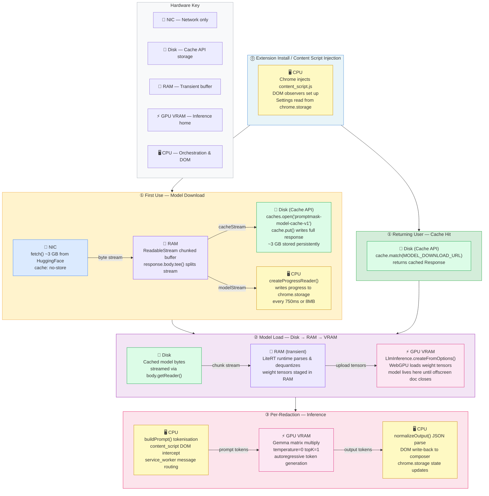

```mermaid
flowchart TD
    subgraph STAGE0["⓪ Extension Install / Content Script Injection"]
        direction LR
        CPU0["🖥️ CPU\nChrome injects content_script.js\nDOM observers set up\nSettings read from chrome.storage"]
    end

    subgraph STAGE1["① First Use — Model Download"]
        direction LR
        NIC["📡 NIC\nfetch() ~3 GB from HuggingFace\ncache: no-store"]
        NIC -->|byte stream| RAM1["🧠 RAM\nReadableStream chunked buffer\nresponse.body.tee() splits stream"]
        RAM1 -->|cacheStream| DISK1["💾 Disk (Cache API)\ncaches.open('promptmask-model-cache-v1')\ncache.put() writes full response\n~3 GB stored persistently"]
        RAM1 -->|modelStream| CPU1["🖥️ CPU\ncreateProgressReader()\nwrites progress to chrome.storage\nevery 750ms or 8MB"]
    end

    subgraph STAGE1B["① Returning User — Cache Hit"]
        direction LR
        DISK1B["💾 Disk (Cache API)\ncache.match(MODEL_DOWNLOAD_URL)\nreturns cached Response"]
    end

    subgraph STAGE2["② Model Load — Disk → RAM → VRAM"]
        direction LR
        DISK2["💾 Disk\nCached model bytes\nstreamed via body.getReader()"]
        DISK2 -->|chunk stream| RAM2["🧠 RAM (transient)\nLiteRT runtime parses & dequantizes\nweight tensors staged in RAM"]
        RAM2 -->|upload tensors| VRAM["⚡ GPU VRAM\nLlmInference.createFromOptions()\nWebGPU loads weight tensors\nmodel lives here until offscreen doc closes"]
    end

    subgraph STAGE3["③ Per-Redaction — Inference"]
        direction LR
        CPU3["🖥️ CPU\nbuildPrompt() tokenisation\ncontent_script DOM intercept\nservice_worker message routing"]
        CPU3 -->|prompt tokens| VRAM3["⚡ GPU VRAM\nGemma matrix multiply\ntemperature=0 topK=1\nautoregressive token generation"]
        VRAM3 -->|output tokens| CPU3B["🖥️ CPU\nnormalizeOutput() JSON parse\nDOM write-back to composer\nchrome.storage state updates"]
    end

    subgraph LEGEND["Hardware Key"]
        direction LR
        L1["📡 NIC — Network only"]
        L2["💾 Disk — Cache API storage"]
        L3["🧠 RAM — Transient buffer"]
        L4["⚡ GPU VRAM — Inference home"]
        L5["🖥️ CPU — Orchestration & DOM"]
    end

    STAGE0 --> STAGE1
    STAGE0 --> STAGE1B
    STAGE1 --> STAGE2
    STAGE1B --> STAGE2
    STAGE2 --> STAGE3

    style STAGE0 fill:#e8f4f8,stroke:#4a90d9
    style STAGE1 fill:#fff3cd,stroke:#f0ad4e
    style STAGE1B fill:#d4edda,stroke:#28a745
    style STAGE2 fill:#f3e5f5,stroke:#9c27b0
    style STAGE3 fill:#fce4ec,stroke:#e91e63
    style LEGEND fill:#f8f9fa,stroke:#adb5bd
    style NIC fill:#dbeafe,stroke:#3b82f6
    style RAM1 fill:#ede9fe,stroke:#7c3aed
    style DISK1 fill:#dcfce7,stroke:#16a34a
    style CPU1 fill:#fef9c3,stroke:#ca8a04
    style DISK1B fill:#dcfce7,stroke:#16a34a
    style DISK2 fill:#dcfce7,stroke:#16a34a
    style RAM2 fill:#ede9fe,stroke:#7c3aed
    style VRAM fill:#fce7f3,stroke:#db2777
    style CPU3 fill:#fef9c3,stroke:#ca8a04
    style VRAM3 fill:#fce7f3,stroke:#db2777
    style CPU3B fill:#fef9c3,stroke:#ca8a04
    style CPU0 fill:#fef9c3,stroke:#ca8a04
```
