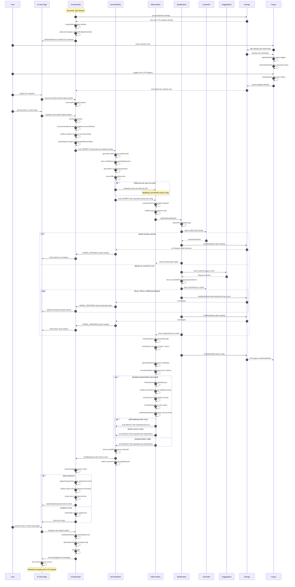

```mermaid
sequenceDiagram
    autonumber

    participant U as User
    participant AI as AI Chat Page
    participant CS as ContentScript
    participant SW as ServiceWorker
    participant OD as OffscreenDoc
    participant MC as ModelCache
    participant CA as CacheAPI
    participant HF as HuggingFace
    participant ST as Storage
    participant PU as Popup

    %% 0. Extension startup / settings load
    Note over CS: document_start injection
    CS->>ST: get promptmask settings
    ST-->>CS: sites and 7 PII category settings
    CS->>CS: mergeSettings apply defaults
    CS->>CS: observeComposer and bindFallbackHandlers
    CS->>AI: MutationObserver watches for composer

    %% 1. User opens popup to configure settings
    U->>PU: clicks extension icon
    PU->>ST: get settings and model state
    ST-->>PU: settings and modelState
    PU->>PU: applySettingsToUI render toggles
    PU->>PU: renderModelState show download status
    U->>PU: toggles site or PII category
    PU->>PU: scheduleSave debounce 100ms
    PU->>ST: persist updated settings
    ST-->>CS: onChanged live settings sync

    %% 2. User types a prompt and hits Send
    U->>AI: typing into composer
    AI->>CS: focusin and input events capture phase
    CS->>CS: track lastFocusedComposer

    U->>AI: presses Enter or clicks Send
    AI->>CS: keydown click submit capture phase
    CS->>CS: handleSendAction
    CS->>CS: consumeSendEvent stopPropagation preventDefault
    CS->>CS: setBusy disable composer and send button

    %% 3. ContentScript sends LLM_PROMPT to ServiceWorker
    CS->>CS: getCategoryConfig and getEnabledPlaceholders
    CS->>SW: LLM_PROMPT with prompt and redactionConfig

    SW->>SW: generate requestId via randomUUID
    SW->>SW: store sendResponse in pendingRequests
    SW->>SW: add tabId to progressSubscribers
    SW->>SW: ensureOffscreenDocument

    alt Offscreen doc does not exist
        SW->>OD: createDocument via offscreen API
        Note over OD: MediaPipe and WASM context ready
    end

    SW->>OD: LLM_PROMPT with requestId prompt and config

    %% 4. Offscreen: model init and optional download
    OD->>OD: enqueueInference serialise requests
    OD->>OD: buildPrompt via offscreen utils
    OD->>MC: getModelAssetReader
    MC->>MC: requestPersistentStorage
    MC->>CA: open model cache bucket

    alt Model already cached
        CA-->>MC: cached Response
        MC->>ST: writeModelState status loading
        ST-->>SW: onChanged model state key
        SW->>CS: MODEL_PROGRESS status loading
        CS->>AI: show spinner in composer
        MC-->>OD: return cached body reader
    else Model not cached first run
        MC->>HF: fetch model file approx 3 GB
        HF-->>MC: Response stream
        MC->>MC: tee into cacheStream and progressStream
        MC->>CA: store cacheStream in cache

        loop Every 750ms or 8MB downloaded
            MC->>ST: writeModelState downloading with byte count
            ST-->>SW: onChanged
            SW->>CS: MODEL_PROGRESS with downloaded bytes
            CS->>AI: update download progress banner
        end

        MC->>ST: writeModelState status loading
        ST-->>SW: onChanged
        SW->>CS: MODEL_PROGRESS status loading
        CS->>AI: hide banner show spinner
        MC-->>OD: return progressStream reader
    end

    %% 5. LLM inference via MediaPipe WebGPU
    OD->>OD: FilesetResolver init with WASM path
    OD->>OD: LlmInference init temp 0 topK 1 seed 1
    MC->>ST: writeModelState status ready
    ST-->>PU: onChanged renderModelState

    OD->>OD: generateResponse returns rawOutput
    OD->>OD: normalizeOutput strip Gemma turn markers

    alt Disallowed placeholder keys found
        OD->>OD: findDisallowedPlaceholderKeys
        OD->>OD: buildCorrectionPrompt with disallowed keys
        OD->>OD: runInference with correction prompt
        OD->>OD: normalizeOutput on retry output
        OD->>OD: findDisallowedPlaceholderKeys second check
        alt Still disallowed after retry
            OD->>SW: LLM_RESULT with requestId and error
        else Clean result on retry
            OD->>SW: LLM_RESULT with requestId and redactedText
        end
    else All placeholders valid
        OD->>SW: LLM_RESULT with requestId and redactedText
    end

    %% 6. ServiceWorker routes result back to ContentScript
    SW->>SW: look up sendResponse by requestId
    SW->>CS: sendResponse with result or error
    SW->>SW: delete requestId from pendingRequests

    %% 7. ContentScript applies redacted text and shows preview
    CS->>CS: looksLikeValidRedaction check

    alt Valid redaction
        CS->>CS: applyComposerText write redacted text back
        CS->>CS: setBusy false restore composer and button
        CS->>CS: phase set to redacted preview
        CS->>AI: toast Redacted press Enter to send
    else Invalid or error
        CS->>CS: resetToIdle restore original text
        CS->>AI: show error toast
    end

    %% 8. User reviews and confirms send
    U->>AI: presses Enter or clicks Send again
    AI->>CS: keydown click capture phase
    CS->>CS: handleSendAction isPreviewReady true
    CS->>CS: allowNativeSubmit set bypass flag
    CS->>CS: resetToIdle
    CS->>AI: event propagates to host page
    AI->>AI: form submitted to AI service
    Note over AI: Redacted message sent no PII exposed
```
